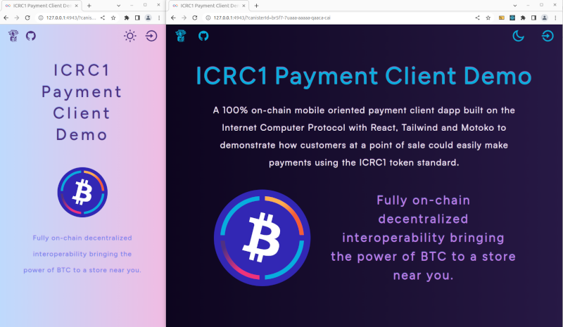

# ICRC1 Payment Client Demo

## Adaption of BNT-3 ICRC1 Compliant Payment Flow with web workers, Tailwind &amp; more...

<p align="center">
  
</p>

### Project Structure
 - [backend](./src/backend/) - backend canister processing ICRC1 payments 
 - [frontend](./src/frontend) - asset canister hosted frontend client to the backend canister
 - [test](./src/test) - unit and e2e testing
 - [workbench](./src/workbench/) - prototyping and integration workbench, included as an example of how testing was iterated
 - [declarations](./src/declarations/) - automatically generated declarations (only backend is used)
 - [icrc1-token-canister](./src/icrc1-token-canister/) - Dfinity provided rosetta based ICRC1 canister wasm and did used to develop backend's interactions with mainnet ICRC1 token canister 

### Setup

Note the setup script requires the current dfx identity not to require unlocking each time a dfx command is issued. 

 1. Clone a local copy from [insert github link]
 2. Install local dependencies and start the local replica testnet configured for the project by entering the command:
 ```bash
    npm run setup
 ```
 3. Once setup finished, start the  backend and frontend dev servers by entering the command:
 ```bash
    npm run start
 ```
 1. Open your browser to `localhost:3000` to interact with the web app's dev server, which will already be connected to the backend canister on the local replica. Alternatively the application is directly available at `http://localhost:4943?canisterId=br5f7-7uaaa-aaaaa-qaaca-cai`.

Now any changes to either the backend or frontend code will be visible in either the browser or declarations file. 

Working with the backend in a Javascript environment is available in the `workbench` subdirectory which a node based project automatically loading the enviromental variables, declarations and utils of the frontend. To run that project `index.js` file, open a new integrated terminal (or terminal of your choice) and from this project's root directory, enter the commands:

```bash
  cd src/workbench
  npm run run
```
You should see that file's console log output in the terminal. Alternatively you can use the Candid UI to interact with the backend canister in the browser, visit the [Internet Computer Guide](https://internetcomputer.org/docs/current/developer-docs/backend/motoko/candid-ui) for more information.

Also note in the local testnet, the current dfx identity will receive 100 ICRC1 tokens (normal units) in the ICRC1 account corresponding to the subaccount address created for that identity by the backend payment processing canister. 
### Testing
  1. After a local copy is cloned, all testing can be done by entering the command:
```bash
npm run test
```

All tests are in the [src/test](./src/test/) subdirectory and are managed by the same `Vitest` instance.

The results of the tests will displayed in the terminal output. 

To run tests in watch mode, first `cd` into `src/tests` and then run `npm run test`. Testing is made up of the units tests of the frontend and backend, and the integrated E2E testing which is focused on how the [utils of the web worker](./src/frontend/src/worker/utils.js) process the calls and responses of the backend canister's API and how they are become a part ofthe UI via the `reducer` (that is also used by `CanisterProvider`). For more dedicated projects, using an E2E testing library like [Cypress](https://www.cypress.io/) would provide better coverage. 

An important note is that different environments are used for testing (`jsdom` versus `node`), and `jsdom` may require additional configuration for it to work with `agent-js` out of the box.

This test identity is the ED25519 key pair provided by the `dfx nns extension` code base. If the project is started with the testing flag (`npm run test` in the project's root directory) this identity will receive 100 CVCMICRC1 to use.

### Note on Setup and Test Scripts

This project uses the bash scripting library [zx](https://github.com/google/zx) to issue the commands to start and configure the local replica. When `npm run start` or `npm run test` is entered, first `npm ci` is run in each project's root subdirectories (`frontend`, `test`, `workbench`), and the `setup.js` script is run. This script uses `zx` along with some utility methods in `script-utils.js` to:
 1. Load the environmental variables from the `.env` file generated by `dfx` when building the canisters into the local execution context with `dotenv`.
 2. Check the ICRC1 Rosetta based wasm and did exist locally, if not downloading them with the [install.sh](./src/icrc1-token-canister/install.sh) script.
 3. Install the canisters in order so their ids remain constant. Note that as `zx` accepts template literals as input, the [script-utils.js](./script-utils.js) utility methods often simply return the command line argument as a literal to be used by `zx`. In particular, this can make it easier to dynamically deploy the ICRC1 token canister during local development for instance.
 4. Gets the `icrc1_token_canister` canister's id and uses it to call the backend's `set_icrc1_token_canister_id` canister method, updating the backend canister to use that canister to process payments.
 5. Also calls the backend canister to get the ICRC1 account address associated with the current `dfx` identity's principal, to which 100 normal units worth of (mock) ICRC1 tokens are sent. If testing, additionally transfer similar amounts of ICRC1 tokens to the test identities used. 
 6. This should all be displayed in the terminal's output. 

Also note that this project, as mentioned, includes the integrated local Internet Identity canister. 

### backend canister - The Payments Processor

This is the canister that processes payments. 

Note that the ICRC1 token canister is dynamically set, so the `set_icrc1_token_canister_id` must be called once before it can process any payments by sending transfers. 

Also note that all addresses it uses are its own subaccounts, so for a caller to send a payment through the backend canister, they must first deposit some ICRC1 tokens into their account address to credit it. Currently it maps only one subaccount to each caller, generating the subaccount with the utils method [getAccountUserSubaccount](./src/backend/utils.mo#L44). 

All the API methods are typed which can be viewed in its [Types.mo](./src/backend/types.mo) file.  

[Mops](https://mops.one/) is used for including for the stable hashmap and SHA2 dependencies. 

[mo-dev](https://medium.com/dfinity/announcing-the-motoko-dev-server-live-reloading-for-web3-dapps-20363088afb4) is used for live reloading. 

### frontend canister - The Payments Processor's GUI

This is a Vite bundled, React and Tailwind based web app that uses a web worker to handle all processing with the backend canister so it occurs off the main thread. 

Web workers have a different context and 

For more details, check out its [README](./src/frontend/README.md).

<p align="center">
  
</p>

### Additional Links

This project was orignally based on: 

- [Vite React Motoko Template](https://github.com/rvanasa/vite-react-motoko/tree/main) 
- [AuthClient Demo](https://github.com/krpeacock/auth-client-demo/tree/main)  
- [IC Web Workers](https://github.com/peterpeterparker/icwebworker/tree/main) 

And is adapted as a payment client, with the objectives of being mobile oriented with Tailwind and for the use of the background processing of web workers, from the [BNT-3: Sample App - ICRC-1 Compliant Payment Flow](https://github.com/dfinity/grant-rfps/issues/7). 

For additional information and resources also see: 
- [BNT-6: Point-of-Sale Payment Dapp](https://github.com/dfinity/grant-rfps/issues/36)
- [Chain-key Bitcoin (ckBTC)](https://internetcomputer.org/docs/current/developer-docs/integrations/bitcoin/ckbtc)
- [ICRC1 Token Standard](https://internetcomputer.org/docs/current/developer-docs/integrations/icrc-1/)